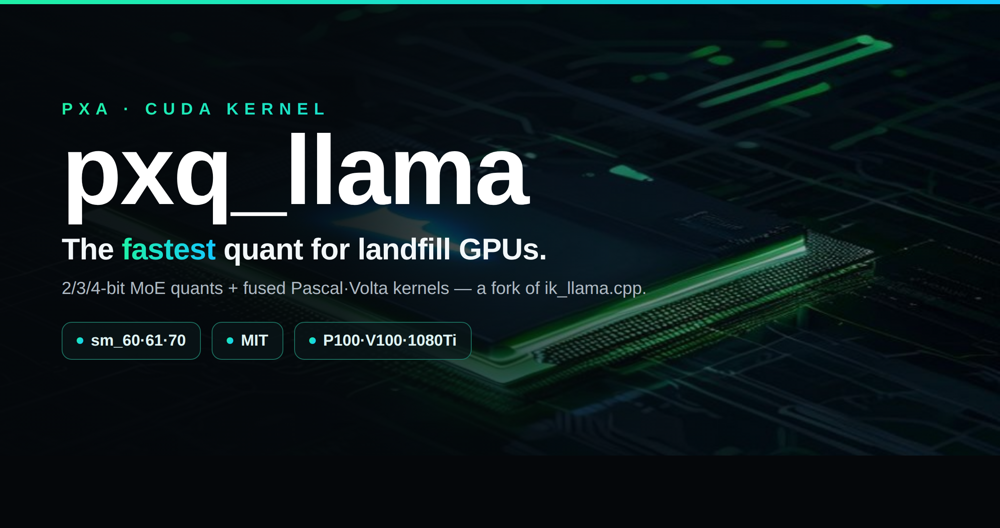
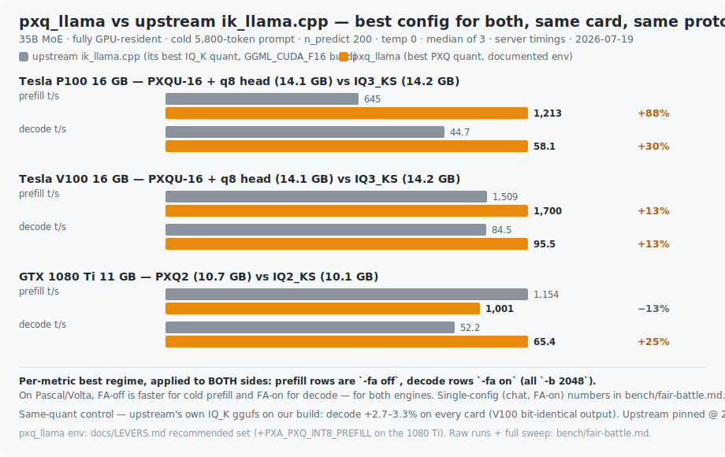

<!-- GitHub README for the kernel repo (pxq_llama, a fork of ik_llama.cpp). -->
<p align="center"></p>

# pxq_llama — run PXQ-quantized models (revive your landfill GPUs)

A fork of [ik_llama.cpp](https://github.com/ikawrakow/ik_llama.cpp) — a **general MoE accelerator for
Pascal/Volta silicon** (and modern cards), plus **PXQ**, a family of PXA-native low-bit quants. The
engine work — an sm_60 fp16-GEMM gate fix, a flash-attention regime fix, MoE-path fixes, and correct
`np>1` hybrid concurrency — speeds up **any** MoE on these cards, at any size, and it **scales from one
salvaged card to a multi-card `-sm layer` spread to CPU/RAM offload**. So it runs a **35B on a single
12–16 GB card**, and it runs **120B / 122B-class MoEs** across a stack of old Teslas — faster than
mainline ik in every config measured so far. Built to give old hardware a second life instead of the
e-waste bin.

> **The single-card 35B below is the reproducible proof-of-concept** — one $150 card, one downloadable
> GGUF, a chart you can rebuild. It's the on-ramp, not the ceiling: the same engine + PXQ tiers carry
> straight up to big multi-card MoEs (a published multi-card bench is coming; today those wins are
> measured, not yet charted here).

Models: **https://github.com/poisonxa16/pxq_llama** ← you are here · Weights: [huggingface.co/poisonxa](https://huggingface.co/poisonxa)

> 💛 Support: **https://ko-fi.com/shatteredrealms1**

## Head-to-head vs upstream ik_llama.cpp

Best config for **both** sides — upstream at its own documented best (its best-fitting IQ_K quant,
`GGML_CUDA_F16` build), pxq_llama at its documented best (`docs/LEVERS.md`). Same card, same cold
5.8k-token prompt, temp 0, median of 3. Full methodology + raw runs: [`bench/fair-battle.md`](bench/fair-battle.md).

<p align="center"></p>

## Updates — 2026-07-19

- **⭐ Fair battle vs upstream published** (chart above): best config for both sides, per metric.
  Two ways to read it, both honest — **one interactive server** (`-fa on`, chat/agent) gets
  **P100 +59% prefill / +30% decode *simultaneously***, V100 +12% / +14%, 1080 Ti −10% / +25%;
  a **batch prefill pass** (`-fa off`) pushes prefill to **+88% P100** (the chart's headline
  prefill bars) at the cost of decode. You pick one FA setting per server — see the regime table
  in `docs/COOKBOOK.md`. Same-quant control (upstream's own IQ_K ggufs on our build): decode
  +2.7–3.3% everywhere, V100 output bit-identical. Upstream keeps a cold-prefill edge on the
  1080 Ti — printed, not hidden. Full sweep: `bench/fair-battle.md`.
- **⭐ Naming: the PXQ tiers are re-laddered by bit class.** The 4-bit quality tier is now **PXQ4**
  (formerly PXQ6) and its HQ variant **PXQ4-HQ** (formerly PXQ6HQ) — the name now tells you the
  bit-width, matching PXQ2/PXQ3. Nothing binary changed: gguf type ids are identical, existing
  `.gguf` files keep working, and `llama-quantize` accepts the old names (`PXQ6`, `PXQ6HQ`) as
  aliases forever. The two *legacy* formats that previously used nearby names are retired from the
  ladder: the MXFP4 slab repack (old "PXQ4") is now **PXQ4-LEGACY**, and **PXQ5** (superseded
  numerics) is legacy. Env vars (`PXA_PXQ6_*`) and already-published HF artifact filenames
  (`*-PXQ6.gguf`) keep the old identifier — see `docs/RENAME-MAP.md` for the full mapping.
- **Fix:** the experimental V100 WMMA prefill kernel (`PXA_PXQ6_WMMA`) was launched with 64 threads
  instead of its required 256 — enabling it produced garbage output. Fixed; all non-WMMA paths are
  byte-unchanged. (It remains experimental and off by default: measured honest gain is +0.97% prefill.)
- **New recommended env:** `PXA_FUSE_DELTANET=3` (bit-exact DeltaNet decode fusion) and a **q8_0
  output head** in the quant recipe. Measured together: PXQU-16 decode **57.2 → 62.4 t/s (P100)**,
  **98.5 → 101.3 t/s (V100)**. Late addition, same protocol: **`PXA_G2_ADDFUSE=1`** (bit-exact
  residual-add fusion) adds **+1.9% (V100)** / **+1.2% (P100)** decode on top.
- **New docs:** `docs/LEVERS.md` — every `PXA_*` env var with its default, mechanism, measured
  effect, and gate class (including the documented dead ends); `docs/COOKBOOK.md` — per-card
  recommended command lines with expected numbers; `docs/KNOWN-ISSUES.md`; `docs/RENAME-MAP.md`.
- **New (opt-in): int8 DP4A prefill for 10-series cards** — `PXA_PXQ_INT8_PREFILL=1` routes PXQ
  prefill GEMMs through an int8 dp4a MMQ-style tile on sm_61 (GTX 10-series), where the fp16-family
  path has no fast dot product. Measured on a 1080 Ti (PXQ2, cold 5.8k-token prompt, `-ub 768`):
  **251 → 709 t/s prefill (+182%)**, decode untouched, flag-off dispatch byte-identical. Not
  bit-exact vs the fp16 path (int8 activation quantization; temp-0 output sha-identical in our
  gates, top-1 logits identical on every spot-check) — hence opt-in, default OFF.
- **Corrections** to the published speed table (a withdrawn V100 4-bit-flagship row and the 1080 Ti prefill
  micro-batch annotation): see `bench/README.md`.
- New env-gated diagnostics/experiments (all default-off): `PXA_EXPERT_LOG` (per-request MoE
  expert-routing histograms, np1 only), `PXA_PASCAL_DMMV` (documented dead end, measured loss),
  `PXA_CUDA_GRAPH_V2` + `PXA_CUDA_GRAPH_LOG` (CUDA-graph replay semantics repair; measured neutral
  -to-negative on our cards — instrumentation honesty, not a speed claim).

## What's PXQ?

PXQ quantizes MoE **expert** tensors (the bulk of the params) with a learned codebook + **E16-row
scales** — a per-row fp16 anchor (amortized 2 bytes/row over a 64-row panel) plus a 4-bit sub-scale
per 16-element block. On top of that sit bit-exact fused CUDA kernels (grouped-MoE GEMM, K-split
decode, gate/up fusion) tuned for Pascal/Volta.

| type | bits | expert wrel vs 4-bit | notes |
|---|---|---|---|
| PXQ4 (formerly PXQ6) | 4.27 bpw | 1.0× (−12.6% vs plain 4-bit float) | flagship 4-bit |
| PXQ3 | 3.27 bpw | ~2.1× | 3-bit, bit-plane packed |
| PXQ2 | 2.27 bpw | ~4.4× | 2-bit, LM4 codebook |

The backbone (attention / router / embeddings) stays MXFP4 (standard mixed-precision). Numerics are
imatrix-calibrated and gated byte-exact against a reference (Q-G1 byte-parity + Q-G2 wrel).

## Scales up — one card to a rack

The 35B single-card story is the reproducible demo, not the scope. Two independent layers:

- **The engine** (format-agnostic, helps any quant): the sm_60 fp16-GEMM gate fix, the FA-regime
  handling, the MoE-path fixes, and correct `np>1` hybrid concurrency speed up **any MoE at any size**
  on Pascal/Volta — measured faster than mainline ik on **gpt-oss-120B and 122B-class** models, in
  single-card, multi-card `-sm layer` spread, **and** CPU/RAM offload configs.
- **The PXQ quant** (GPU-resident MoE): the 2/3/4-bit + universal tiers apply at every model size and
  beat ik's IQ_K where the model is resident. (PXQ has no CPU codec — for a partial-offload run use a
  standard quant on the fast engine; the PXQ speed comparison is GPU-resident.)

So: pile up 2 / 4 / 6 salvaged Teslas and run a big MoE the same way you'd run the 35B on one. A
published multi-card head-to-head is coming; today the 35B fair-battle (above) is the fully
reproducible chart, and the big-model wins are measured but not yet charted here.

## Build (CUDA)

Requires the NVIDIA container toolkit (or a local CUDA 12.x toolchain). Arches sm_60;61;70 cover
P100 / 1080Ti / V100; add your own (e.g. 86, 89) for newer cards.

```bash
git clone https://github.com/poisonxa16/pxq_llama && cd pxq_llama
# inside an nvidia/cuda:12.8.1-devel image (or a matching local toolchain):
cmake -B build -S . -DCMAKE_CUDA_ARCHITECTURES="60;61;70;86;89" -DGGML_CUDA=ON
cmake --build build --target llama-server llama-quantize llama-perplexity -j
# NOTE: linking needs the CUDA driver lib (run under --runtime=nvidia, or have libcuda on the link path).
```

## Run

```bash
LD_LIBRARY_PATH=build/bin:build/src:build/ggml/src \
PXA_PXQ6=1 PXA_PXQ2=1 PXA_PXQ3=1 \
PXA_PXQ6_KSPLIT=1 PXA_PXQ6_VECX=1 PXA_PXQ6_GUFUSE=1 PXA_PXQ6_SCATFUSE=1 PXA_PXQ6_RAGTAIL=1 \
PXA_FUSE_DELTANET=3 PXA_G2_ADDFUSE=1 \
./build/bin/llama-server -m PXA-Fusion2-35B-PXQ3.gguf \
  -c 8192 -ngl 99 -sm layer -fa on -ctk f16 -ctv f16 -b 512 -ub 512 \
  --jinja --temp 1.0 --top-p 0.95 --top-k 20 --host 0.0.0.0 --port 8080
```
- `PXA_PXQ6/2/3=1` enable the format families (set all three for a UNIVERSAL/mixed model).
  (Env names keep the internal `PXQ6` identifier for the 4-bit tier — see `docs/RENAME-MAP.md`.)
- `PXA_PXQ6_{KSPLIT,VECX,GUFUSE,SCATFUSE,RAGTAIL}=1` are the bit-exact fast kernels.
- `PXA_FUSE_DELTANET=3` (recommended, 2026-07-19) fuses the DeltaNet decode glue kernels —
  bit-exact, measured +3.7% decode on P100 (part of the 62.4 / 101.3 t/s numbers in `bench/`).
- `PXA_G2_ADDFUSE=1` (recommended, 2026-07-19) residual-add fusion — bit-exact, +1.9% V100 /
  +1.2% P100 decode. Full lever reference incl. what NOT to bother with: `docs/LEVERS.md`.
- `PXA_PXQ_INT8_PREFILL=1` (opt-in, sm_61/GTX-10-series): int8 dp4a prefill tile — +182%
  prefill on a 1080 Ti at 95% of the native-MMQ ceiling; decode byte-untouched. `=2` lifts the
  arch gate for testing (do NOT ship on sm_60 — its dp4a is emulated).
- `PXA_PXQ6_WMMA=1` is an experimental V100 tensor-core prefill path (auto-guarded to 4-bit only).
  Measured e2e gain after the 2026-07-19 launch fix: +0.97% prefill — kept for experimentation,
  not part of the recommended env.
- Vision: `--mmproj mmproj-*.gguf`. MTP (flagship): `--spec-type mtp:n_max=3,p_min=0.5`.

## Quantize your own

```bash
# pure tier (one uniform bit-width — "pick your quality"):
./build/bin/llama-quantize --imatrix your.imatrix model-bf16.gguf out-PXQ3.gguf PXQ3

# PXQU — PXQ-Universal ("pick your card"): a knapsack mix of PXQ2/3/4 per expert tensor,
# sized so the model runs FULL ub2048 prefill on one card. Presets are BAKED IN — this
# works from a bare clone, no side files.
# NOTE: --pxq-universal is a flag; it must come BEFORE the positional in/out/type args
# (put it after them and you get "invalid ftype '--pxq-universal'"). See docs/KNOWN-ISSUES.md.
./build/bin/llama-quantize --imatrix your.imatrix --pxq-universal 16g model-bf16.gguf out-PXQU-16.gguf PXQ_UNIVERSAL    # 14.0 GB -> fills a 16 GB card (P100/V100)
./build/bin/llama-quantize --imatrix your.imatrix --pxq-universal 12g model-bf16.gguf out-PXQU-12.gguf PXQ_UNIVERSAL    # 11.6 GB -> fills a 12 GB card
```
> Running under an `nvidia/cuda` container? A few `ERROR: ... init ... result=11` lines print first —
> that's the NVIDIA runtime's own driver probe, not `llama-quantize`. Harmless; quantization continues.

**⚠ PXQ models must be FULLY GPU-resident** — the CPU MoE op has no PXQ support, so partial
offload (`-ngl < 99` with PXQ expert layers left on CPU, or `--n-cpu-moe`) aborts. Pick the tier
that fits your card *entirely*, VRAM headroom included:
- **16 GB** (P100/V100): PXQU-16 (14.0 GB) or PXQ3.
- **12 GB**: PXQU-12 (11.6 GB).
- **11 GB** (1080 Ti): **PXQ2** (10.7 GB) — PXQU-12 does *not* fit an 11 GB card. With
  `PXA_PXQ_INT8_PREFILL=1` the 1080 Ti gets 709 t/s prefill / 71 t/s decode on PXQ2.

**How PXQU works:** the preset is a per-tensor tier map (`pxa-bench/pxq-universal/*.tiers`,
also compiled into the binary) produced by a Lagrangian-relaxation knapsack over measured
per-tensor quantization sensitivity: each expert tensor gets the lowest-cost tier (PXQ2/
PXQ3/PXQ4) such that total size hits the card budget with minimum weighted error. The
backbone follows the standard PXQ recipe (MXFP4 attention — measured faster than a q6
backbone on Pascal/Volta at equal size, see `bench/HEAD-TO-HEAD.md`). The shipped presets
are computed for the Fusion2-35B (qwen35moe, 40-layer/256-expert) layout; for another
architecture, generate your own map with `pxa-bench/pxq-universal/` tooling and pass the
file path: `--pxq-universal /path/to/map.tiers`.

Per-tensor overrides (`--attn-qkv-type`, `--attn-output-type`, `--output-tensor-type`,
`--token-embedding-type`, ...) now work with PXQ tiers (the override matching bug is
fixed). Note: on Pascal/Volta we measured q6_K attention as a net LOSS for the fast tiers
(KLD wash at fixed size, 3-5% decode cost) — the defaults are the shipped optimum.

**Imatrix provenance (doctrine): quantizing a merged model? Recompute the imatrix ON the merge.**
Imatrix rows are *activation statistics of each tensor's input* — they are anchor-specific, not
weight-specific. In an expert-grafted or blended merge, the grafted tensors now see the *anchor
model's* residual-stream inputs, so a parent model's imatrix is off-distribution exactly on the
tensors the merge changed (and PXQ's windowed scale search + anchor fit consume those weights
directly, so the mismatch concentrates its damage there — we've measured multi-point category
regressions from this alone). One calibration pass through the merged model itself is cheap
insurance and removes all guesswork. Corollary: don't confound the fix with a corpus change —
reuse your standard calibration blend.
⚠ Run the imatrix capture **full-GPU-resident** — the CPU / partial-offload capture path
currently crashes (see `docs/KNOWN-ISSUES.md`).

**Recommended (2026-07-19): add `--output-tensor-type q8_0`.** The single lm_head GEMV is a
surprisingly large slice of the Pascal decode wall (~14% on P100, where int8 is emulated); a q8_0
head costs only +123 MB over the default and measured **+5.2% decode on P100** (57.2 → 60.2 t/s on
PXQU-16) with quality ≥ the default head. The updated `bench/` numbers use it.

⚠ **Do not read-then-rewrite PXQ tensors with `gguf-py`** — no gguf-py size table (mainline's *or*
this fork's) can express the E16-row per-row anchor, so a read-modify-write silently truncates
them. To edit a PXQ model, re-run `llama-quantize` from the bf16/f16 source instead.

## License & credits
**MIT** — this fork inherits the MIT license of its base engines
([ik_llama.cpp](https://github.com/ikawrakow/ik_llama.cpp) / llama.cpp / ggml, © the ggml/llama.cpp/
ik_llama.cpp authors), and the PXQ types + E16-row-scale kernels are contributed under the same MIT terms.
The original LICENSE and AUTHORS are retained unchanged. PXQ quantization and the fused kernels are original
work of the PXA project, built on ikawrakow's ik_llama.cpp.

> Note: the **model weights** published on HuggingFace are a *separate* work under **Apache-2.0** (Qwen3.6
> lineage via Ornith-1.0-35B-AEON / SIQ-1-35B) — see the model card. This repo (code) is MIT; the weights are Apache-2.0.
